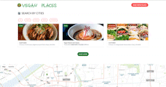

# Vegan Places in Japan

🥗 It is a guide around vegan restaurants around 🇯🇵

🍽 Allows to add new locations.

## How does it look like?

## How to use

Go to [this page](https://veganplacesinjapan.vercel.app/)!

## Tech Stack

- Next JS
- Tailwind
- GraphQL
- GraphCMS
- Google Maps JavaScript API

- Hosting: Vercel

### Features

- This application utilizes [Google Maps JavaScript API](https://developers.google.com/maps/documentation/javascript).

## How to run locally

clone the repo,
`npm install` then `npm run dev`,
then listen to `localhost:3000`
